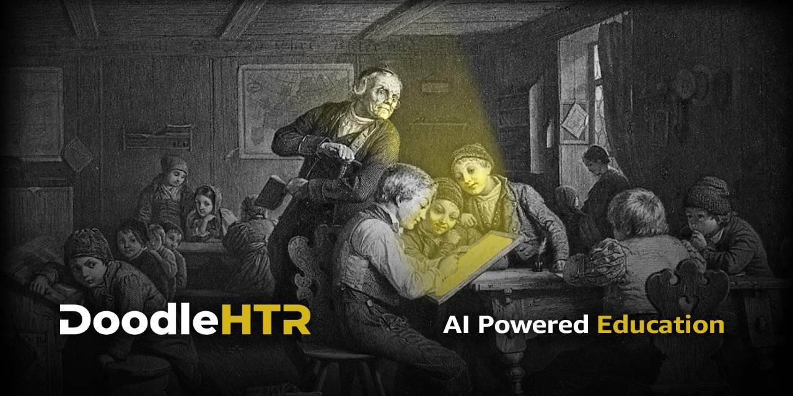

# DoodleHTR

**AI powered Education** - An Electron-based app designed to enhance your study methods with the help of artificial intelligence.

## Description

DoodleHTR is an app that helps you transform your notes into interactive and organized study tools. Using AI, it generates flashcards and LaTeX files from plain text or images of your notes. Perfect for students and educators, DoodleHTR simplifies the study process and makes it easy to create academic materials.

## Features

### 1. Flashcard Creation
- Input text or upload images of your notes.
- The app automatically generates flashcards to help you study more efficiently.

### 2. Interactive Flashcard Study Mode
- Use the flashcards in an interactive interface designed to aid revision.
- Easily review and memorize key concepts.

### 3. LaTeX File Creation
- Convert your notes (text or images) into well-structured PDF files using LaTeX.
- You can also obtain the raw LaTeX code to further customize the output.

### 4. More Features Coming Soon
